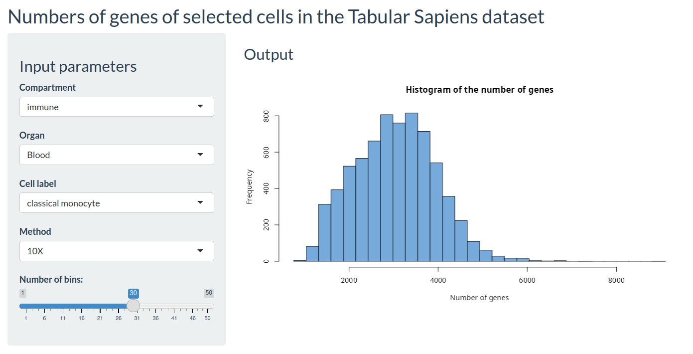
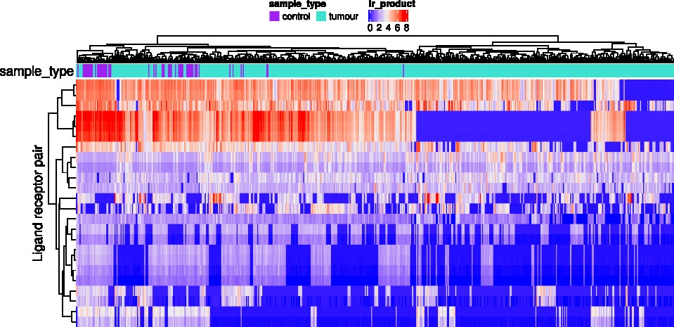
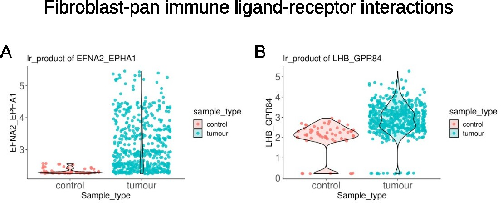

# Portfolio

## [Project 1: Single-cell mean rank gene set scoring method for comparing gene set activity](https://github.com/giuseppedelnapalle/scmrgss)
* Created a straightforward yet informative method called single-cell mean rank gene set scoring (scMRGSS) to compare gene set activity between cell types from either identical or distinct sources using single-cell RNA-seq (scRNA-seq) data.
* Average rank of gene expression is calculated for each gene set (pathway) of interest, followed by normalisation based on the number of expressed genes. 
* Robust to common gene expression normalisation and transformation methods, such as counts per million (CPM), log-transformed CPM, so long as the rank data is preserved.
* Demonstrated its efficacy through both simulated and real-world datasets.
* Applied scMRGSS to glioblastoma data to prove its utility and found cellular heterogeneity in NF-κB pathway activity in glioblastoma.
* Developed utility tools to import and process H5AD, H5, and Loom files to facilitate building analysis workflow as well.
* The program is implemented in Julia.
* [Preprint available](https://doi.org/10.51094/jxiv.580).

**Figure 1**. Propotions of differential KEGG gene sets between cell lines from four separate datasets.

**Figure 2**. NF-κB pathway activity of mesenchymal glioblastoma cancer cells in sample BT346 and truncated radial glia (tRG) from two fetal brain development datasets estimated by scMRGSS.

## [Project 2: Histogram Shiny app for exploration of the Tabular Sapiens scRNA-seq dataset](https://takashisuzuki.shinyapps.io/hist_ts_shiny/)
* Created an interactive histogram of the number of genes of selected cells in the Tabular Sapiens dataset using Shiny.
* Using the Scanpy Python package, cell meta data was extracted from the H5AD file containing the dataset.
* The Shiny app simplifies the exploration of the distribution of the number of genes in cells of interest in an interactive way.
* Effective for diverse data analysis scenarios using the comprehensive human scRNA-seq dataset.

## [Project 3: Inferring intercellular protein-protein interactions from deconvoluted bulk RNA-seq data](https://github.com/giuseppedelnapalle/intercellular_PPI_inference)
* Developed three methods to quantify intercellular protein-protein interactions (PPIs) from deconvoluted bulk RNA-seq data.
* Method 1 primarily calculates the mean ligand receptor expression value of two cell types in each bulk RNA-seq sample.
* Method 2 calculates the product of ligand and receptor expression values between cell types.
* Method 3 is derived from method 2 and defines the regularised product as sqrt(l\*r) / (mu+sqrt(l\*r)), where mu denotes the mean of the combined expression matrix.
* Built a pipeline to preprocess RNA-seq data, perform RNA-seq deconvolution using CIBERSORTx, estimate PPIs, and display the results.
* Python and R were used in the project.

**Figure 1**. Ligand-receptor interactions between fibroblasts and pan-immune cells in lung adenocarcinoma estimated by the ligand-receptor product method.

**Figure 2**. Upregualted ligand-receptor interactions between fibroblasts and pan-immune cells in lung adenocarcinoma.
