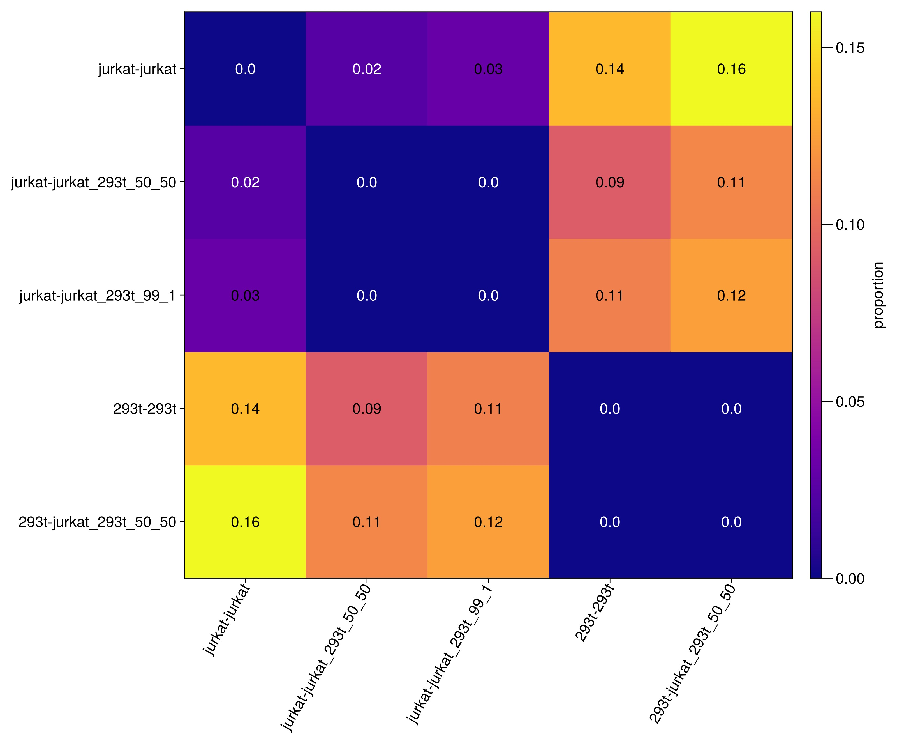
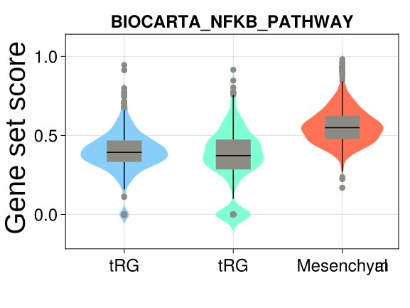

# Portfolio

## [Project 1: Single-cell mean rank gene set scoring method for comparing gene set activity](https://github.com/giuseppedelnapalle/scmrgss)
* Created a straightforward yet informative method called single-cell mean rank gene set scoring (scMRGSS) to compare gene set activity between cell types from either identical or distinct sources using single-cell RNA-seq (scRNA-seq) data.
* Average rank of gene expression is calculated for each gene set (pathway) of interest, followed by normalisation based on the number of expressed genes. 
* Robust to common gene expression normalisation and transformation methods, such as counts per million (CPM), log-transformed CPM, so long as the rank data is preserved.
* Demonstrated its efficacy through both simulated and real-world datasets.
* Applied scMRGSS to glioblastoma data to prove its utility and found cellular heterogeneity in NF-κB pathway activity in glioblastoma.
* Developed utility tools to import and process H5AD, H5, and Loom files to facilitate building analysis workflow as well.
* The program is implemented in Julia.
* [Preprint available](https://doi.org/10.51094/jxiv.580).

**Figure 1**. Propotions of differential KEGG gene sets between cell lines from four separate datasets.

**Figure 2**. NF-κB pathway activity of mesenchymal glioblastoma cancer cells in sample BT346 and truncated radial glia (tRG) from two fetal brain development datasets estimated by scMRGSS.
